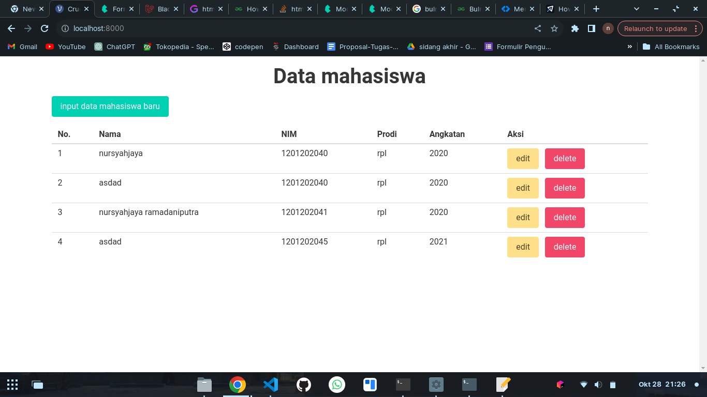

# crud mahasiswa

## description
contoh crud menggunakan laravel 8, 

- menggunakan bulma untuk mempermudah pembuatan style.
- penggunaan laravel 8, agar bisa mendukung php 7

## usage
buat database baru sesuai yang ada di file .env

```bash
composer install
php artisan migrate
php artisan serve
```

## screenshot


